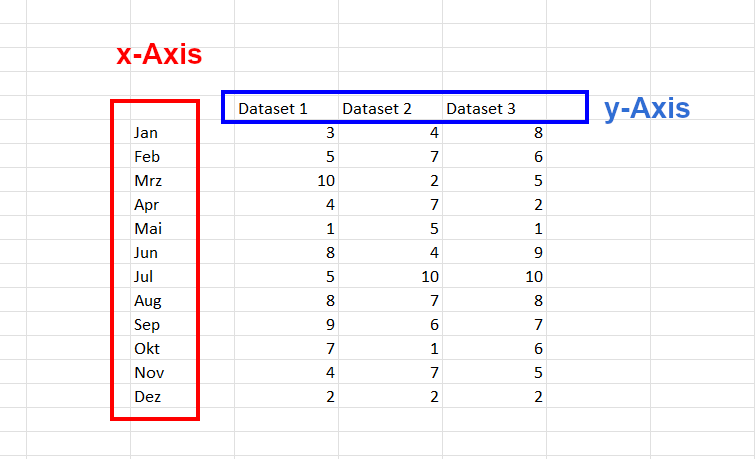
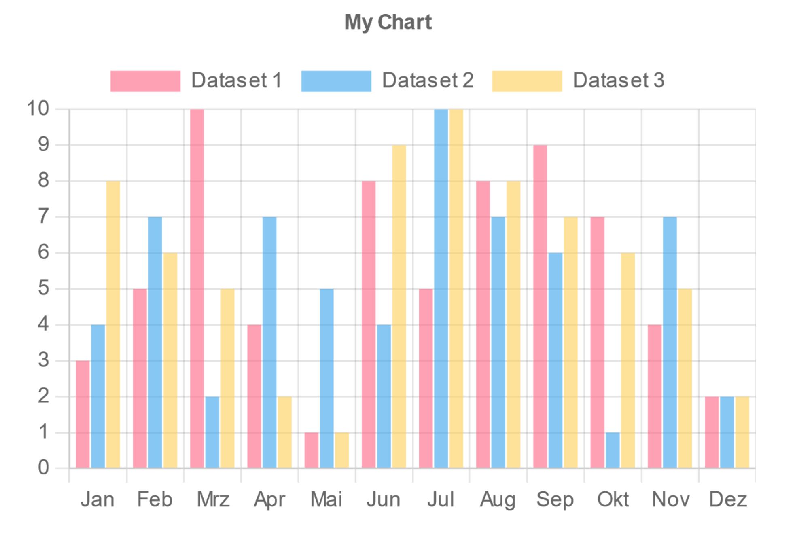
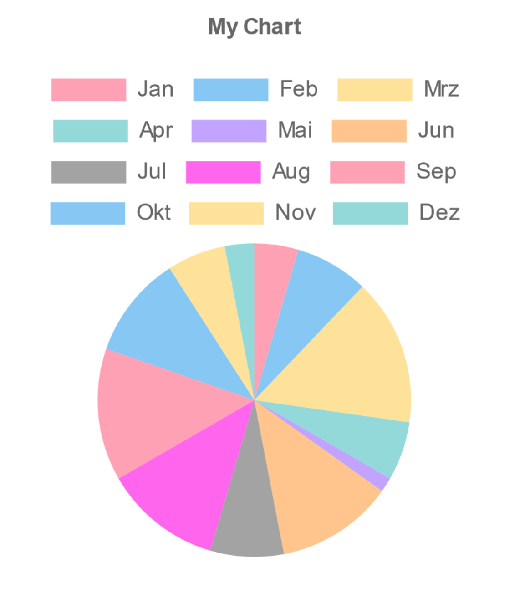

# Canva Chart Creator App

You can use this app to easily create bar, line, radar, pie, doughnut and polar area charts for your presentations by uploading a .csv file as data source.

---

### CSV table structure

The table in the CSV file must have a specific structure so in can be parsed successully by the app. 

The structure is shown below:

 

>**Note**
>Please make sure that the number of rows multiplied by the number of coloumns in your table does not exceed 200.
>In this example the number would be 12 * 3 = 36.
>It is important to know that any customization regarding the datasets, labels and scaling must be done in the CSV file at the moment.
>The dataset labels are directly taken from the CSV file and cannot be changed after uploading.
>If you do not want to have labels on the x-axis just insert a blank space instead (e.g. replacing Jan, Feb, Mrz etc. with spaces).

 

---

### Options and customization

Scroll through the app to see all available options. Some are only available for certian types of charts (e.g. horizontal layout can only be applied to bar/line charts).

---

Icons by svgrepo.com
