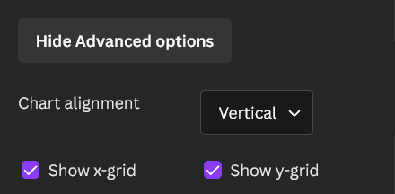
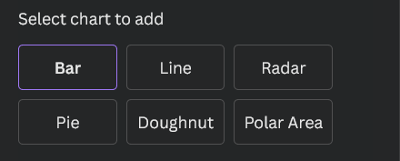

# Canva Chart Creator App

You can use this app to easily create bar, line, radar, pie, doughnut and polar area charts for your presentations by uploading a .csv file as data source.

---

### CSV Table structure

The table in the .csv file must have a specific structure so in can be parsed successully by the app. 

The structure is shown below:

 

>**Note**
>Please make sure that the number of rows multiplied by the number of coloumns in your table does not exceed 200.
>In this example the number would be 12 * 3 = 36.

>**Note**
>If you do not want to have labels on the x-axis just insert a blank space instead.
>E.g. replacing Jan, Feb, Mrz etc. with spaces.

 

---

### General Options

The general options are the basic options which apply to all types of charts. They include the chart title, chart dimensions and some basic customization  options.

---

### Advanced Options

The advanced options are only available for the bar and line charts and let you change the chart alignment and visibility of the axes. 

 

---

### Dataset Options

The dataset options can be opened by clicking on the bars/dots of the bar/line chart or the corresponding area of a pie chart (see image). Those options let you customize datasets individually (e.g. colour).

---

### Export Options

Choose the type of your chart.
 

---

Icons by svgrepo.com
